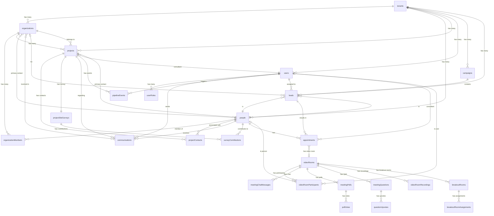

# Sunup Platform - Entity Relationship Diagram

## Core Data Model Overview

This document shows the relationships between all entities in the Sunup platform.

## Mermaid ER Diagram



## Entity Descriptions

### Core Entities

#### **tenants**
- Multi-tenant root entity
- Each tenant represents a solar installation company using Sunup
- Contains tenant-specific settings (pipeline stages, commission rules)
- All data is scoped to tenant

#### **organizations**
- Represents customers: Households, Companies, Nonprofits, Government entities
- Types: Residential, Commercial, Nonprofit, Government, Educational
- Has billing address and primary contact
- Can have multiple projects at different locations

#### **people**
- Individuals who interact with the system
- Can belong to multiple organizations (e.g., works at company, lives in household)
- Can be associated with multiple projects in different roles
- Primary contacts for organizations and/or projects

#### **projects**
- Central entity for work being done
- Project Types: "Solar Installation", "Battery Storage", "EV Charger", etc.
- Belongs to one organization, located at specific address
- Tracks through pipeline stages
- Has associated people with different roles

### Relationship Tables

#### **organizationMembers**
- Many-to-many relationship between organizations and people
- Tracks role within organization (Owner, Employee, Facilities Manager, etc.)
- Identifies billing contacts

#### **projectContacts**
- Many-to-many relationship between projects and people
- Tracks role per project (Decision Maker, Technical Contact, Billing Contact, etc.)
- Identifies primary contact for each project

### Project-Related Entities

#### **projectSiteSurveys**
- One-to-one with project
- Contains photos, measurements, AI analysis
- Can be self-service (customer-completed) or professional
- Tracks review/approval workflow

#### **surveyContributions**
- Tracks which people contributed to which parts of survey
- Enables collaborative survey completion
- Records contribution types (photos, measurements, notes)

#### **pipelineEvents**
- Event-driven architecture support
- Records all stage changes and status updates
- Enables real-time notifications and triggers
- Audit trail for project progression

### Sales & Lead Management

#### **campaigns**
- Sundialer campaigns for lead management
- Configurable assignment types (manual, round-robin, effort-based)
- Contains multiple leads

#### **leads**
- Pre-project contacts
- Person expressing interest (representing organization)
- Tracks source, status, assignment
- Converts to project on sale

#### **appointments**
- Scheduled meetings between consultants and people
- Can result from lead, or be follow-up/design review
- Tracks status, meeting links (WebRTC), notes

### System Entities

#### **users**
- System users (employees/contractors of tenant company)
- Roles: Setter, Consultant, PM, Installer, Support, Admin, etc.
- Uses Clerk for authentication
- Multi-role support possible

#### **communications**
- All interactions between users and people
- Types: call, email, SMS, in-app message, meeting
- Context: person, organization, project (if applicable)
- Stores recordings, transcripts, AI summaries

### Video Conferencing (WebRTC Platform)

#### **videoRooms**
- Virtual meeting rooms for video conferencing
- Types: Consultant meetings (1-to-1), Trainer sessions (1-to-200)
- Feature toggles: chat, polls, Q&A, reactions, breakout rooms, recording
- Settings: permissions, waiting room, noise cancellation
- Linked to appointments for scheduled meetings

#### **videoRoomParticipants**
- Tracks who is in each video room
- Can be internal users or external people (customers)
- Status: waiting room → admitted → active → left
- Tracks audio/video/screen share state
- Hand raising and spotlight features

#### **videoRoomRecordings**
- Cloud recordings of video sessions
- Automatic transcription and captions
- Used for training library and compliance

#### **meetingChatMessages**
- In-meeting text chat
- Public messages (to all) or private (1-to-1)
- File sharing support
- Persisted for meeting history

#### **meetingPolls**
- Interactive polls during meetings
- Multiple choice questions
- Host controls (show/hide results, lock poll)
- Used for training assessment and quick feedback

#### **pollVotes**
- Individual participant votes on polls
- One vote per participant per poll
- Real-time results aggregation

#### **meetingQuestions**
- Structured Q&A for large sessions
- Participants submit written questions
- Upvoting mechanism for prioritization
- Host can answer or dismiss questions
- Essential for 200-participant Trainer sessions

#### **questionUpvotes**
- Tracks which participants upvoted which questions
- Determines question priority (most upvoted answered first)

#### **breakoutRooms**
- Sub-rooms created from main session
- Used for small group exercises during training
- Auto-close timer functionality
- Broadcast messages to all breakout rooms

#### **breakoutRoomAssignments**
- Assigns participants to specific breakout rooms
- Tracks join/leave times per room
- Auto-assignment or manual assignment by host

---

## Key Relationships Explained

### Organization → Project → People Flow

```
Organization (ABC Corp)
    ├─ Member: John Smith (Employee, Billing Contact)
    ├─ Member: Jane Doe (Facilities Manager)
    └─ Projects:
        ├─ Project 1: "HQ Solar"
        │   ├─ Location: Austin, TX
        │   ├─ Primary Contact: Jane Doe
        │   └─ Contacts:
        │       ├─ Jane Doe (Technical Contact, Primary)
        │       └─ John Smith (Billing Contact)
        │
        └─ Project 2: "Warehouse Solar"
            ├─ Location: Dallas, TX
            ├─ Primary Contact: Jane Doe
            └─ Contacts:
                ├─ Jane Doe (Technical Contact, Primary)
                └─ John Smith (Billing Contact)
```

### Communication Context

```
User (Consultant) → Communication → Person (Jane Doe)
    ↓
Context includes:
    - Organization: ABC Corp
    - Project: HQ Solar (if discussing specific project)
    - Type: Meeting
    - Recording, transcript, AI summary
```

### Site Survey Flow

```
Project (HQ Solar)
    ↓
Site Survey (self-service)
    ├─ Photos uploaded
    ├─ Measurements entered
    └─ Contributions:
        ├─ Jane Doe: Roof photos
        └─ Tom Wilson: Electrical panel photos
    ↓
Consultant reviews → Approves
    ↓
PM receives project with survey data
```

### Pipeline Event Flow

```
Project stage changes: Design → Permitting
    ↓
Pipeline Event created:
    - fromStage: "Design"
    - toStage: "Permitting"
    - triggeredBy: User (PM)
    ↓
Triggers:
    - Notification to Consultant
    - Update to timeline
    - Commission calculation (if applicable)
```

---

## Indexes for Performance

### Critical Query Patterns

All tables include:
- `by_tenant` index for multi-tenant data isolation
- Entity-specific indexes for common queries

**Example queries supported:**
```typescript
// Get all projects for an organization
projects.by_organization(organizationId)

// Get all people in an organization
organizationMembers.by_organization(organizationId)

// Get all contacts for a project
projectContacts.by_project(projectId)

// Get all projects for a consultant
projects.by_consultant(consultantUserId)

// Get all communications for a project
communications.by_project(projectId)

// Get appointments for a consultant on a specific day
appointments.by_consultant(consultantUserId)
  .filter(apt => apt.scheduledFor >= startOfDay && apt.scheduledFor < endOfDay)
```

---

## Data Model Principles

### 1. **Multi-Tenancy First**
- Every entity includes `tenantId`
- All queries scoped by tenant
- Tenant isolation at data layer

### 2. **Flexibility Through Relationships**
- Many-to-many relationships enable complex scenarios
- People can have multiple organizations
- Projects can have multiple contacts
- Clear role definition per relationship

### 3. **Event-Driven Architecture**
- Pipeline events enable reactive updates
- Real-time notifications
- Audit trail and analytics

### 4. **Extensibility**
- Project types beyond "Solar Installation"
- Communication types extensible
- User roles extensible
- Custom fields via JSON where needed

### 5. **Real-Time Collaboration**
- Multiple people can contribute to surveys
- Convex enables real-time updates
- Optimistic UI updates possible

---

## Future Schema Additions

**Planned entities not yet in schema:**

- **commissions** - Track commission calculations and payments
- **scripts** - Sales Manager-created scripts for Consultants, Recruiters, Support
- **scriptVersions** - Version control for scripts
- **trainingCourses** - Trainer-managed courses
- **quizzes** - Assessment system for trainees
- **teamAssignments** - Setter Manager team compositions
- **activityTracking** - Effort metrics for round-robin algorithms
- **troubleTickets** - Multi-tier support system
- **documents** - Permits, contracts, warranties
- **equipment** - Inventory management
- **installationSchedules** - Crew scheduling
- **inspections** - Tracking inspection results

---

_This ER diagram represents the core data model as of the initial architecture phase._
_Last Updated: 2025-11-03_
