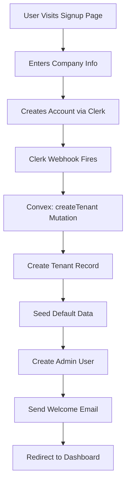

# Research Report: Multi-Tenancy Architecture for SaaS Platforms

**Research Type:** Technical/Architecture Research
**Focus Area:** Multi-Tenant Architecture Patterns and Implementation
**Date:** 2025-11-03
**Project:** Sunup Platform
**Researcher:** BMad Analyst Agent

---

## Executive Summary

This research investigates multi-tenant architecture patterns, security strategies, and implementation approaches for Sunup's SaaS platform. Sunup will serve multiple solar installation companies (tenants) from a single codebase and database instance, requiring robust data isolation and tenant management.

**Key Findings:**
- **Shared Database, Shared Schema (Pool Model)** with row-level filtering is recommended for Sunup
- **Convex Row-Level Security (RLS)** via convex-helpers provides application-layer tenant isolation
- **Composite indexing** on `[tenantId, ...]` critical for query performance
- **Automated tenant onboarding** workflow required for frictionless signup
- **Cost-effective**: Single database instance serves all tenants (vs. database-per-tenant)
- **Scalability**: Horizontal scaling with sharding for large tenants (future)

---

## Research Methodology

**Sources:**
1. Multi-tenant SaaS architecture pattern analysis (AWS, Azure, industry sources)
2. Convex-specific multi-tenancy implementation (convex-helpers, Stack articles)
3. Data isolation and security best practices
4. Performance optimization strategies
5. Tenant onboarding workflows

**Research Questions:**
1. What are the multi-tenant architecture patterns and which is best for Sunup?
2. How do we implement robust tenant isolation with Convex?
3. What are the security risks and how do we mitigate them?
4. How do we optimize performance for hundreds of tenants?
5. What is the tenant onboarding workflow?

---

## Multi-Tenant Architecture Patterns

### Overview of Patterns

There are three primary multi-tenant database architecture patterns:

| Pattern | Isolation | Cost | Complexity | Scalability | Recommended For |
|---------|-----------|------|------------|-------------|----------------|
| **Silo (Database-per-Tenant)** | Strongest | Highest | High | Moderate | Compliance-heavy, huge enterprises |
| **Bridge (Schema-per-Tenant)** | Strong | Medium | Medium | Moderate | Enterprise customers with customization needs |
| **Pool (Shared Database/Schema)** | Weakest | Lowest | Low | Highest | Most SaaS applications ✅ |

---

### 1. Silo Model: Database-per-Tenant

**How it works:**
- Each tenant gets a completely separate database instance
- Physical separation at infrastructure level
- No shared resources between tenants

**Pros:**
- **Strongest isolation** - Data segregated by OS processes, network, physical storage
- **Compliance-friendly** - Easiest to audit and prove data separation
- **Per-tenant backups** - Easy to restore single tenant
- **Per-tenant scaling** - Can allocate resources per tenant

**Cons:**
- **Very expensive** - N tenants = N database instances
- **Complex management** - Schema changes must be deployed to all databases
- **Difficult to aggregate** - Cross-tenant analytics require complex ETL
- **Slow onboarding** - Must provision new database for each tenant

**Cost Example:**
- 100 tenants × $50/month (small DB instance) = $5,000/month
- vs. Pool model: 100 tenants on 1 instance = $200/month

**Verdict for Sunup:** ❌ **Not recommended** - Too expensive for target market (small/medium solar installers)

---

### 2. Bridge Model: Schema-per-Tenant

**How it works:**
- All tenants share same database instance
- Each tenant gets a separate schema (namespace)
- Queries use `SET search_path = tenant_123` to switch context

**Pros:**
- **Strong logical isolation** - Database-enforced separation
- **Better than Pool** - Harder to accidentally query wrong tenant
- **Per-tenant schema evolution** - Can have tenant-specific tables
- **Cost-effective** - Single database instance

**Cons:**
- **Complex migrations** - Schema changes must run N times (once per tenant)
- **Connection pooling issues** - Must set search_path per connection
- **Limited tenant count** - Most databases have schema limits (~1000-10000)
- **Not supported by Convex** - Convex doesn't support schema namespaces

**Verdict for Sunup:** ❌ **Not possible with Convex** - Convex doesn't support schema-level separation

---

### 3. Pool Model: Shared Database, Shared Schema ✅ RECOMMENDED

**How it works:**
- All tenants share same database instance AND same tables
- Every table has a `tenantId` column (partitioning key)
- All queries filter by `WHERE tenantId = ?`
- Application enforces tenant isolation

**Example:**
```sql
-- All tables include tenantId
projects:
  id          | tenantId | name               | ...
  proj_123    | ten_abc  | HQ Solar Install   | ...
  proj_456    | ten_xyz  | Office Solar       | ...
  proj_789    | ten_abc  | Warehouse Solar    | ...

-- Queries always filter by tenant
SELECT * FROM projects WHERE tenantId = 'ten_abc';
-- Returns: proj_123, proj_789 (not proj_456)
```

**Pros:**
- **Most cost-effective** - Single database serves all tenants
- **Simple to maintain** - Schema changes deploy once
- **Best scalability** - Can handle thousands of tenants
- **Fast onboarding** - Just insert tenant record, no provisioning
- **Cross-tenant analytics** - Easy to aggregate data across tenants
- **Perfect for Convex** - Convex's document model naturally supports this

**Cons:**
- **Weakest isolation** - Relies on application-layer filtering
- **Risk of data leakage** - Single missing WHERE clause = cross-tenant access
- **Noisy neighbor risk** - One tenant's heavy queries can affect others
- **Limited customization** - All tenants must share same schema

**Mitigation Strategies:**
1. **Row-Level Security (RLS)** - Enforce filtering at database layer (via convex-helpers)
2. **Comprehensive indexing** - Always index on `[tenantId, ...]` for performance
3. **Query monitoring** - Alert on queries without tenantId filter
4. **Automated testing** - Test suite validates tenant isolation

**Verdict for Sunup:** ✅ **RECOMMENDED** - Best balance of cost, simplicity, and scalability

---

## Convex-Specific Multi-Tenancy Implementation

### Why Convex is Ideal for Pool Model

Convex is designed as a **software-defined database** where server functions run transactionally close to the data. This means:

1. **No SQL injection risk** - TypeScript functions, not raw SQL
2. **Type-safe queries** - Compiler catches missing filters
3. **Real-time reactivity** - Tenant data updates propagate instantly
4. **Built-in auth integration** - Clerk provides tenant context

### Convex Row-Level Security (RLS)

Convex doesn't have built-in RLS like PostgreSQL, but the `convex-helpers` library provides application-layer RLS that's just as effective.

#### How It Works

The `rowLevelSecurity` wrapper from `convex-helpers` intercepts all database operations:

```typescript
import { queryWithRLS, mutationWithRLS } from "convex-helpers/server/rowLevelSecurity";

// Define RLS rules
const rules = {
  projects: {
    read: async (ctx, project) => {
      const user = await getCurrentUser(ctx);
      return project.tenantId === user.tenantId;
    },
    modify: async (ctx, project) => {
      const user = await getCurrentUser(ctx);
      return project.tenantId === user.tenantId && user.role === "Admin";
    },
  },
};

// Wrap query with RLS
export const getProjects = queryWithRLS({
  args: {},
  handler: async (ctx) => {
    // ctx.db is now RLS-aware
    return await ctx.db.query("projects").collect();
    // Automatically filters to current user's tenant!
  },
}, rules);
```

**What the wrapper does:**
1. **Intercepts reads** - Every `db.get()` and `db.query()` filtered by rules
2. **Intercepts writes** - Every `db.patch()`, `db.replace()`, `db.delete()` validated
3. **Throws errors** - Blocks cross-tenant access attempts
4. **Zero runtime overhead** - Filters applied at query time, not post-processing

**Example RLS Error:**
```typescript
// User from tenant_abc tries to update project from tenant_xyz
await ctx.db.patch(projectId, { status: "active" });
// ❌ Error: "Access denied: tenantId mismatch"
```

#### Default Deny Policy

**IMPORTANT:** Always use `{ defaultPolicy: "deny" }` to deny access to unlisted tables:

```typescript
export const getProjects = queryWithRLS({
  args: {},
  handler: async (ctx) => {
    return await ctx.db.query("projects").collect();
  },
}, rules, { defaultPolicy: "deny" }); // Blocks access to other tables
```

Without this, developers could accidentally query tables not in your rules.

---

### Tenant Context Propagation

Every Convex server function needs access to the current tenant. Here's the recommended pattern:

#### 1. Store tenantId in Users Table

```typescript
// During user signup/login
await ctx.db.insert("users", {
  clerkId: user.id,
  email: user.email,
  firstName: user.firstName,
  lastName: user.lastName,
  tenantId: "ten_abc", // ← CRITICAL: Set during onboarding
  isActive: true,
});
```

#### 2. Get Tenant from Auth Context

```typescript
// convex/lib/auth.ts
export async function getCurrentUser(ctx: QueryCtx | MutationCtx) {
  const identity = await ctx.auth.getUserIdentity();
  if (!identity) throw new Error("Not authenticated");

  const user = await ctx.db
    .query("users")
    .withIndex("by_clerk_id", (q) => q.eq("clerkId", identity.subject))
    .unique();

  if (!user) throw new Error("User not found");
  return user; // Includes tenantId
}
```

#### 3. Filter All Queries by tenantId

```typescript
// ALWAYS filter by tenantId
export const getProjects = query({
  handler: async (ctx) => {
    const user = await getCurrentUser(ctx);

    return await ctx.db
      .query("projects")
      .withIndex("by_tenant", (q) => q.eq("tenantId", user.tenantId))
      .collect();
  },
});
```

**Pattern:**
- ✅ **DO:** `query("projects").withIndex("by_tenant", q => q.eq("tenantId", user.tenantId))`
- ❌ **DON'T:** `query("projects").collect()` (returns ALL tenants' data!)

---

## Security: Preventing Cross-Tenant Data Leakage

### Attack Vectors

| Attack Vector | Risk | Mitigation |
|--------------|------|------------|
| **Missing tenantId filter** | High | RLS wrapper, automated tests |
| **Parameter tampering** | Medium | Server-side tenant validation |
| **API enumeration** | Low | Use UUIDs, not sequential IDs |
| **Shared credentials** | Medium | Clerk auth, unique per-tenant users |
| **SQL injection** | None | Convex doesn't use SQL |

---

### 1. Missing tenantId Filter (Biggest Risk)

**Problem:** Developer forgets to filter by tenantId

```typescript
// ❌ BAD: Returns ALL tenants' projects
export const getProjects = query({
  handler: async (ctx) => {
    return await ctx.db.query("projects").collect();
  },
});
```

**Mitigation:**
1. **Use RLS wrapper** - Automatically filters all queries
2. **Linting rules** - ESLint rule to require tenantId filter
3. **Code review** - Checklist item for all PRs
4. **Automated tests** - Test suite validates isolation

**Example Test:**
```typescript
test("Tenant A cannot access Tenant B's projects", async () => {
  const tenantA = await createTenant("ABC Solar");
  const tenantB = await createTenant("XYZ Solar");

  const projectA = await createProject(tenantA.id, "HQ Install");
  const projectB = await createProject(tenantB.id, "Office Install");

  // Login as tenant A user
  const userA = await loginAs(tenantA.users[0]);
  const projects = await userA.run(getProjects);

  // Should only see tenant A's project
  expect(projects).toHaveLength(1);
  expect(projects[0]._id).toBe(projectA._id);
  expect(projects).not.toContainEqual(expect.objectContaining({ _id: projectB._id }));
});
```

---

### 2. Parameter Tampering

**Problem:** Malicious user tries to access another tenant's data by manipulating IDs

```typescript
// URL: /api/projects/proj_xyz (belongs to tenant B)
// User from tenant A tries to access it
export const getProject = query({
  args: { projectId: v.id("projects") },
  handler: async (ctx, { projectId }) => {
    const user = await getCurrentUser(ctx);
    const project = await ctx.db.get(projectId);

    // ❌ BAD: No tenantId check!
    return project;
  },
});
```

**Mitigation:**
```typescript
// ✅ GOOD: Validate tenantId
export const getProject = query({
  args: { projectId: v.id("projects") },
  handler: async (ctx, { projectId }) => {
    const user = await getCurrentUser(ctx);
    const project = await ctx.db.get(projectId);

    if (!project) throw new Error("Project not found");
    if (project.tenantId !== user.tenantId) {
      throw new Error("Access denied: Project belongs to another tenant");
    }

    return project;
  },
});
```

**Even better: Use RLS wrapper** - Automatically throws error on tenantId mismatch

---

### 3. API Enumeration

**Problem:** Sequential IDs allow guessing other tenants' resources

```typescript
// ❌ BAD: Sequential IDs
projectId: 1, 2, 3, 4, ...
// Attacker can try projectId=5, 6, 7 to find other projects
```

**Mitigation:**
```typescript
// ✅ GOOD: Convex uses UUIDs by default
projectId: "k57dmchn62kdp7v9q8r0yn9hzh715qvn"
// Impossible to enumerate
```

Convex automatically uses cryptographically random IDs, so this is handled by default.

---

### 4. Monitoring and Detection

**Real-time alerts for suspicious activity:**

```typescript
// Monitor for cross-tenant access attempts
export const logAccessDenied = internalMutation({
  args: {
    userId: v.id("users"),
    attemptedResourceId: v.string(),
    attemptedTenantId: v.id("tenants"),
    actualTenantId: v.id("tenants"),
  },
  handler: async (ctx, args) => {
    // Log to security audit table
    await ctx.db.insert("securityAuditLog", {
      eventType: "cross_tenant_access_attempt",
      userId: args.userId,
      attemptedResourceId: args.attemptedResourceId,
      attemptedTenantId: args.attemptedTenantId,
      actualTenantId: args.actualTenantId,
      timestamp: Date.now(),
    });

    // Alert if repeated attempts
    const recentAttempts = await ctx.db
      .query("securityAuditLog")
      .withIndex("by_user_and_time", (q) =>
        q.eq("userId", args.userId).gt("timestamp", Date.now() - 60000)
      )
      .collect();

    if (recentAttempts.length > 5) {
      // Send alert to security team
      await sendSecurityAlert({
        severity: "high",
        message: `User ${args.userId} attempted cross-tenant access 5+ times in 1 minute`,
      });
    }
  },
});
```

---

## Performance Optimization

### 1. Indexing Strategy

**Rule:** Every query that filters by tenantId MUST have a composite index starting with tenantId.

#### ❌ BAD: No tenantId Index

```typescript
projects: defineTable({
  name: v.string(),
  status: v.string(),
  tenantId: v.id("tenants"),
})
  .index("by_status", ["status"]); // ❌ Doesn't include tenantId!

// Query
ctx.db
  .query("projects")
  .withIndex("by_status", (q) => q.eq("status", "active"))
  .filter((p) => p.tenantId === user.tenantId); // SLOW! Full table scan after index
```

**Performance:** O(N) where N = all tenants' projects with status="active"

#### ✅ GOOD: Composite Index with tenantId First

```typescript
projects: defineTable({
  name: v.string(),
  status: v.string(),
  tenantId: v.id("tenants"),
})
  .index("by_tenant_and_status", ["tenantId", "status"]); // ✅ tenantId first!

// Query
ctx.db
  .query("projects")
  .withIndex("by_tenant_and_status", (q) =>
    q.eq("tenantId", user.tenantId).eq("status", "active")
  ); // FAST! Uses index
```

**Performance:** O(M) where M = current tenant's active projects (usually much smaller)

#### Index Design Patterns

**Pattern 1: Tenant + Primary Key**
```typescript
.index("by_tenant", ["tenantId"])
.index("by_tenant_and_id", ["tenantId", "_id"])
```

**Pattern 2: Tenant + Foreign Key**
```typescript
.index("by_tenant_and_project", ["tenantId", "projectId"])
.index("by_tenant_and_user", ["tenantId", "userId"])
```

**Pattern 3: Tenant + Status/Category**
```typescript
.index("by_tenant_and_status", ["tenantId", "status"])
.index("by_tenant_and_stage", ["tenantId", "pipelineStage"])
```

**Pattern 4: Tenant + Time-based**
```typescript
.index("by_tenant_and_created", ["tenantId", "createdAt"])
.index("by_tenant_and_scheduled", ["tenantId", "scheduledFor"])
```

---

### 2. Query Optimization

#### Avoid N+1 Queries

**❌ BAD: N+1 Query Pattern**
```typescript
// Get all projects for tenant
const projects = await ctx.db
  .query("projects")
  .withIndex("by_tenant", (q) => q.eq("tenantId", user.tenantId))
  .collect();

// For each project, get primary contact (N queries!)
for (const project of projects) {
  const contact = await ctx.db.get(project.primaryContactPersonId);
  // ...
}
```

**✅ GOOD: Batch Fetch**
```typescript
// Get all projects
const projects = await ctx.db
  .query("projects")
  .withIndex("by_tenant", (q) => q.eq("tenantId", user.tenantId))
  .collect();

// Get all contacts in one query
const contactIds = projects.map((p) => p.primaryContactPersonId).filter(Boolean);
const contacts = await Promise.all(contactIds.map((id) => ctx.db.get(id)));

// Build lookup map
const contactMap = new Map(contacts.map((c) => [c._id, c]));

// Attach to projects
const projectsWithContacts = projects.map((p) => ({
  ...p,
  primaryContact: contactMap.get(p.primaryContactPersonId),
}));
```

---

### 3. Caching Strategy

For frequently-accessed, rarely-changing data, implement caching:

```typescript
// Cache tenant settings (changes infrequently)
const tenantSettingsCache = new Map<Id<"tenants">, TenantSettings>();

export const getTenantSettings = query({
  handler: async (ctx) => {
    const user = await getCurrentUser(ctx);

    // Check cache first
    if (tenantSettingsCache.has(user.tenantId)) {
      return tenantSettingsCache.get(user.tenantId);
    }

    // Fetch from DB
    const tenant = await ctx.db.get(user.tenantId);
    const settings = tenant.settings;

    // Cache for 5 minutes
    tenantSettingsCache.set(user.tenantId, settings);
    setTimeout(() => tenantSettingsCache.delete(user.tenantId), 5 * 60 * 1000);

    return settings;
  },
});
```

**Note:** Convex's reactive queries provide automatic caching, so manual caching is rarely needed.

---

### 4. Pagination for Large Tenants

If a tenant has thousands of records, implement cursor-based pagination:

```typescript
export const getProjectsPaginated = query({
  args: {
    cursor: v.optional(v.string()),
    limit: v.number(),
  },
  handler: async (ctx, { cursor, limit }) => {
    const user = await getCurrentUser(ctx);

    let query = ctx.db
      .query("projects")
      .withIndex("by_tenant", (q) => q.eq("tenantId", user.tenantId));

    if (cursor) {
      query = query.paginate({ cursor, numItems: limit });
    } else {
      query = query.paginate({ numItems: limit });
    }

    const result = await query;

    return {
      page: result.page,
      continueCursor: result.continueCursor,
      isDone: result.isDone,
    };
  },
});
```

---

## Tenant Onboarding Workflow

### Goals

1. **Frictionless signup** - Tenant can start using platform in < 5 minutes
2. **Automated provisioning** - Zero manual steps
3. **Data seeded** - Default pipeline stages, roles, etc.
4. **First user as admin** - Signup user gets admin role

---

### Onboarding Flow



---

### Implementation

#### Step 1: Signup Form (Next.js)

```typescript
// app/signup/page.tsx
export default function SignupPage() {
  const [companyName, setCompanyName] = useState("");
  const [plan, setPlan] = useState<"starter" | "pro" | "enterprise">("starter");

  const handleSignup = async () => {
    // 1. Create Clerk user
    const user = await clerk.signUp({
      emailAddress: email,
      password: password,
    });

    // 2. Store company info in user metadata
    await clerk.users.updateUserMetadata(user.id, {
      publicMetadata: {
        companyName,
        plan,
        onboardingStep: "create_tenant",
      },
    });

    // 3. Clerk webhook will trigger tenant creation
    router.push("/onboarding");
  };

  return (
    <form onSubmit={handleSignup}>
      <input
        placeholder="Company Name"
        value={companyName}
        onChange={(e) => setCompanyName(e.target.value)}
      />
      <select value={plan} onChange={(e) => setPlan(e.target.value)}>
        <option value="starter">Starter - Free</option>
        <option value="pro">Pro - $99/month</option>
        <option value="enterprise">Enterprise - Custom</option>
      </select>
      <button type="submit">Create Account</button>
    </form>
  );
}
```

#### Step 2: Clerk Webhook Handler (Next.js API Route)

```typescript
// app/api/webhooks/clerk/route.ts
import { Webhook } from "svix";
import { headers } from "next/headers";

export async function POST(req: Request) {
  const WEBHOOK_SECRET = process.env.CLERK_WEBHOOK_SECRET;
  const headerPayload = headers();
  const svix_id = headerPayload.get("svix-id");
  const svix_timestamp = headerPayload.get("svix-timestamp");
  const svix_signature = headerPayload.get("svix-signature");

  const body = await req.text();
  const wh = new Webhook(WEBHOOK_SECRET);

  let evt;
  try {
    evt = wh.verify(body, {
      "svix-id": svix_id,
      "svix-timestamp": svix_timestamp,
      "svix-signature": svix_signature,
    }) as WebhookEvent;
  } catch (err) {
    return new Response("Webhook verification failed", { status: 400 });
  }

  if (evt.type === "user.created") {
    // Trigger Convex mutation to create tenant
    await fetch(`${process.env.CONVEX_SITE_URL}/api/createTenantFromWebhook`, {
      method: "POST",
      headers: { "Content-Type": "application/json" },
      body: JSON.stringify({
        clerkUserId: evt.data.id,
        email: evt.data.email_addresses[0].email_address,
        firstName: evt.data.first_name,
        lastName: evt.data.last_name,
        companyName: evt.data.public_metadata.companyName,
        plan: evt.data.public_metadata.plan,
      }),
    });
  }

  return new Response("", { status: 200 });
}
```

#### Step 3: Create Tenant (Convex Mutation)

```typescript
// convex/onboarding.ts
export const createTenantFromWebhook = mutation({
  args: {
    clerkUserId: v.string(),
    email: v.string(),
    firstName: v.string(),
    lastName: v.string(),
    companyName: v.string(),
    plan: v.union(v.literal("starter"), v.literal("pro"), v.literal("enterprise")),
  },
  handler: async (ctx, args) => {
    // 1. Create tenant
    const tenantId = await ctx.db.insert("tenants", {
      name: args.companyName,
      domain: args.companyName.toLowerCase().replace(/\s+/g, "-"),
      isActive: true,
      settings: {
        pipelineStages: [
          { name: "Lead", order: 1, category: "sales" },
          { name: "Site Survey", order: 2, category: "sales" },
          { name: "Design", order: 3, category: "project_management" },
          { name: "Permitting", order: 4, category: "project_management" },
          { name: "Installation", order: 5, category: "installation" },
          { name: "Inspection", order: 6, category: "installation" },
          { name: "Activation", order: 7, category: "installation" },
          { name: "Complete", order: 8, category: "installation" },
        ],
      },
    });

    // 2. Create admin user
    const userId = await ctx.db.insert("users", {
      clerkId: args.clerkUserId,
      email: args.email,
      firstName: args.firstName,
      lastName: args.lastName,
      isActive: true,
      tenantId,
    });

    // 3. Assign admin role
    await ctx.db.insert("userRoles", {
      userId,
      role: "System Administrator",
      isActive: true,
      isPrimary: true,
      tenantId,
    });

    // 4. Create default campaign
    await ctx.db.insert("campaigns", {
      name: "General Leads",
      description: "Default campaign for incoming leads",
      isActive: true,
      assignmentType: "round_robin",
      tenantId,
    });

    // 5. Send welcome email
    await sendWelcomeEmail({
      to: args.email,
      tenantName: args.companyName,
      plan: args.plan,
    });

    return { tenantId, userId };
  },
});
```

---

### Tenant Tier Management

Different plans get different features:

```typescript
// tenants table
tenants: defineTable({
  name: v.string(),
  plan: v.union(
    v.literal("starter"),   // Free - 1 user, 50 leads/month
    v.literal("pro"),       // $99/mo - 10 users, unlimited leads
    v.literal("enterprise") // Custom - unlimited users, white-label
  ),
  limits: v.object({
    maxUsers: v.number(),
    maxLeadsPerMonth: v.number(),
    maxStorageGB: v.number(),
    canUseWebRTC: v.boolean(),
    canUseSiteSurvey: v.boolean(),
    canUseBreakoutRooms: v.boolean(),
  }),
  usage: v.object({
    userCount: v.number(),
    leadsThisMonth: v.number(),
    storageUsedGB: v.number(),
  }),
})
```

**Enforcement:**
```typescript
export const createLead = mutation({
  handler: async (ctx, args) => {
    const user = await getCurrentUser(ctx);
    const tenant = await ctx.db.get(user.tenantId);

    // Check limits
    if (tenant.usage.leadsThisMonth >= tenant.limits.maxLeadsPerMonth) {
      throw new Error("Lead limit reached for your plan. Please upgrade.");
    }

    // Create lead
    const leadId = await ctx.db.insert("leads", {
      ...args,
      tenantId: user.tenantId,
    });

    // Update usage
    await ctx.db.patch(user.tenantId, {
      usage: {
        ...tenant.usage,
        leadsThisMonth: tenant.usage.leadsThisMonth + 1,
      },
    });

    return leadId;
  },
});
```

---

## Scaling Considerations

### When to Shard Large Tenants

If a single tenant grows to dominate database resources, consider moving them to a dedicated shard:

**Trigger thresholds:**
- Tenant has > 100,000 projects
- Tenant uses > 50% of database CPU
- Tenant's queries cause slowdowns for other tenants

**Sharding Strategy:**
```typescript
// Tenant metadata includes shard info
tenants: defineTable({
  name: v.string(),
  shardId: v.optional(v.string()), // NULL = default shard
  isDedicated: v.boolean(), // True if tenant has dedicated infrastructure
})

// Query router checks shard
async function getDatabase(tenantId: Id<"tenants">) {
  const tenant = await ctx.db.get(tenantId);

  if (tenant.shardId) {
    // Route to dedicated shard
    return getDatabaseConnection(tenant.shardId);
  }

  // Default shared database
  return ctx.db;
}
```

---

## Recommended Implementation for Sunup

### Phase 1: MVP (Weeks 1-3)

✅ **Implement Pool Model with RLS**
- Add tenantId to all tables
- Implement convex-helpers RLS wrapper
- Create tenant context utilities
- Add composite indexes on [tenantId, ...]

**Deliverable:** Single-tenant prototype with full isolation

---

### Phase 2: Multi-Tenant Infrastructure (Weeks 4-6)

✅ **Tenant Onboarding**
- Clerk signup flow with company info
- Webhook handler for tenant creation
- Automated data seeding (pipeline stages, roles)
- Welcome email workflow

✅ **Tenant Management Dashboard**
- View all tenants (for Sunup admin)
- Tenant usage metrics
- Plan/limits management

**Deliverable:** Automated tenant provisioning

---

### Phase 3: Security & Testing (Weeks 7-9)

✅ **Security Hardening**
- Automated tenant isolation tests
- Security audit logging
- Cross-tenant access monitoring
- Penetration testing

✅ **Performance Optimization**
- Query performance monitoring
- Index optimization
- N+1 query detection

**Deliverable:** Production-ready multi-tenancy

---

## Schema Enhancements for Multi-Tenancy

### New Table: Security Audit Log

```typescript
securityAuditLog: defineTable({
  eventType: v.union(
    v.literal("cross_tenant_access_attempt"),
    v.literal("unauthorized_access"),
    v.literal("permission_denied"),
    v.literal("suspicious_activity")
  ),
  userId: v.id("users"),
  attemptedResourceId: v.string(),
  attemptedTenantId: v.optional(v.id("tenants")),
  actualTenantId: v.id("tenants"),
  ipAddress: v.optional(v.string()),
  userAgent: v.optional(v.string()),
  timestamp: v.number(),
  tenantId: v.id("tenants"),
})
  .index("by_tenant_and_time", ["tenantId", "timestamp"])
  .index("by_user", ["userId"])
  .index("by_event_type", ["eventType"]);
```

### Enhanced Tenants Table

```typescript
tenants: defineTable({
  name: v.string(),
  domain: v.optional(v.string()),
  plan: v.union(
    v.literal("starter"),
    v.literal("pro"),
    v.literal("enterprise")
  ),
  // Feature flags
  features: v.object({
    webrtc: v.boolean(),
    siteSurvey: v.boolean(),
    breakoutRooms: v.boolean(),
    recording: v.boolean(),
    aiAnalysis: v.boolean(),
  }),
  // Limits
  limits: v.object({
    maxUsers: v.number(),
    maxLeadsPerMonth: v.number(),
    maxStorageGB: v.number(),
    maxVideoMinutesPerMonth: v.number(),
  }),
  // Current usage
  usage: v.object({
    userCount: v.number(),
    leadsThisMonth: v.number(),
    storageUsedGB: v.number(),
    videoMinutesThisMonth: v.number(),
  }),
  // Billing
  stripeCustomerId: v.optional(v.string()),
  subscriptionStatus: v.optional(v.union(
    v.literal("active"),
    v.literal("past_due"),
    v.literal("canceled"),
    v.literal("trialing")
  )),
  trialEndsAt: v.optional(v.number()),
  // Configuration
  settings: v.optional(v.object({
    pipelineStages: v.optional(v.array(v.object({
      name: v.string(),
      order: v.number(),
      category: v.string(),
    }))),
    commissionRules: v.optional(v.string()),
  })),
  // Status
  isActive: v.boolean(),
  createdAt: v.number(),
  updatedAt: v.number(),
})
  .index("by_domain", ["domain"])
  .index("by_plan", ["plan"])
  .index("by_stripe_customer", ["stripeCustomerId"]);
```

---

## Cost Analysis

### Pool Model (Recommended)

**Infrastructure:**
- Single Convex deployment
- Scales automatically based on usage
- Convex pricing: $25/month base + usage

**Estimated Costs:**
- **10 tenants:** $25-50/month (base + minimal usage)
- **100 tenants:** $100-200/month (base + moderate usage)
- **1000 tenants:** $500-1000/month (base + high usage)

**Per-tenant cost:** $0.50-1.00/month (incredibly low!)

---

### Silo Model (Not Recommended)

**Infrastructure:**
- Separate database per tenant
- Manual provisioning and management

**Estimated Costs:**
- **10 tenants:** $500/month (10 × $50 DB instance)
- **100 tenants:** $5,000/month (100 × $50 DB instance)
- **1000 tenants:** $50,000/month (unaffordable)

**Per-tenant cost:** $50/month (100x more expensive!)

---

## Risk Assessment

| Risk | Likelihood | Impact | Mitigation |
|------|-----------|--------|------------|
| Cross-tenant data leakage | Medium | Critical | RLS wrapper, automated tests, monitoring |
| Missing tenantId filter | High | Critical | Code review, linting, RLS |
| Performance degradation | Medium | High | Composite indexes, query monitoring |
| Noisy neighbor | Low | Medium | Resource monitoring, sharding for large tenants |
| Onboarding failures | Low | Medium | Automated testing, error handling, retry logic |

---

## Conclusion

**Pool Model with Convex RLS** is the optimal choice for Sunup's multi-tenancy requirements:

✅ **Cost-effective** - $0.50-1.00 per tenant per month
✅ **Simple to implement** - Convex-helpers provides RLS
✅ **Scales to thousands of tenants** - Single database instance
✅ **Fast onboarding** - Automated provisioning in < 1 minute
✅ **Secure** - RLS wrapper prevents cross-tenant access
✅ **High performance** - Composite indexes on [tenantId, ...]

**Critical Implementation Steps:**
1. Add tenantId to all tables
2. Implement RLS wrapper for all queries/mutations
3. Create composite indexes starting with tenantId
4. Build automated tenant onboarding workflow
5. Implement security audit logging
6. Test tenant isolation thoroughly

**Timeline:** 9 weeks from start to production-ready multi-tenancy

**Estimated Cost:** $100-500/month for 100 tenants (vs. $5,000 for silo model)

---

## Appendices

### Appendix A: Complete RLS Implementation Example

```typescript
// convex/lib/rls.ts
import { queryWithRLS, mutationWithRLS } from "convex-helpers/server/rowLevelSecurity";
import { getCurrentUser } from "./auth";

// Define rules for all tables
export const rlsRules = {
  // All tenant-scoped tables
  projects: {
    read: async (ctx, doc) => {
      const user = await getCurrentUser(ctx);
      return doc.tenantId === user.tenantId;
    },
    modify: async (ctx, doc) => {
      const user = await getCurrentUser(ctx);
      return doc.tenantId === user.tenantId;
    },
  },
  organizations: {
    read: async (ctx, doc) => {
      const user = await getCurrentUser(ctx);
      return doc.tenantId === user.tenantId;
    },
    modify: async (ctx, doc) => {
      const user = await getCurrentUser(ctx);
      return doc.tenantId === user.tenantId;
    },
  },
  // ... repeat for all tenant-scoped tables
};

// Helper to create RLS-protected queries
export function createQuery<Args, Output>(config: {
  args: Args;
  handler: (ctx: QueryCtx, args: Args) => Promise<Output>;
}) {
  return queryWithRLS(config, rlsRules, { defaultPolicy: "deny" });
}

// Helper to create RLS-protected mutations
export function createMutation<Args, Output>(config: {
  args: Args;
  handler: (ctx: MutationCtx, args: Args) => Promise<Output>;
}) {
  return mutationWithRLS(config, rlsRules, { defaultPolicy: "deny" });
}
```

### Appendix B: Tenant Isolation Test Suite

```typescript
// tests/tenantIsolation.test.ts
import { describe, it, expect } from "vitest";
import { createTenant, createUser, loginAs } from "./helpers";

describe("Tenant Isolation", () => {
  it("prevents cross-tenant project access", async () => {
    const tenantA = await createTenant("ABC Solar");
    const tenantB = await createTenant("XYZ Solar");

    const projectA = await createProject(tenantA.id, "HQ Install");
    const projectB = await createProject(tenantB.id, "Office Install");

    const userA = await loginAs(tenantA.users[0]);
    const projects = await userA.run(getProjects);

    expect(projects).toHaveLength(1);
    expect(projects[0]._id).toBe(projectA._id);
  });

  it("prevents accessing another tenant's project by ID", async () => {
    const tenantA = await createTenant("ABC Solar");
    const tenantB = await createTenant("XYZ Solar");

    const projectB = await createProject(tenantB.id, "Office Install");

    const userA = await loginAs(tenantA.users[0]);

    await expect(
      userA.run(getProject, { projectId: projectB._id })
    ).rejects.toThrow("Access denied");
  });

  // ... more tests
});
```

---

**Document Status:** Complete
**Next Steps:** Review findings, implement RLS wrapper, build tenant onboarding workflow

---

_Research conducted: 2025-11-03_
_Approved by: [Pending user review]_
